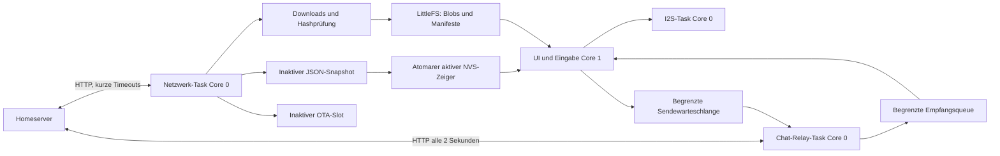

# Architektur und Invarianten

Netzwerk-Worker und UI besitzen getrennte JSON-Dokumente. Ein atomarer
Generationszähler meldet einen neuen Snapshot. Ein Mutex schützt das Laden und
Umschalten der beiden Snapshot-Dateien; HTTP findet nie unter diesem Mutex statt.
Assetdateien sind nach SHA-256 adressiert und unveränderlich. Medien-Decoder
teilen nur einen separat gesperrten Callback-Kontext. Audio und Chat-Relay verwenden
begrenzte Queues. Der Chat-Task besitzt einen eigenen HTTP-Transport und parst
eigene JSON-Dokumente; die UI übernimmt nur feste Queue-Datensätze. Der
Abrufcursor wird erst nach vollständiger Übergabe einer Antwort erhöht. Der
Chat-Task bleibt unabhängig von längeren Inhalts-/Asset-Syncs. Ungelesenstatus
und Historie gehören der UI; Konfigurationsgenerationen verwerfen alte Antworten
bei deaktivierter Kommunikation. Ein kurzer Benachrichtigungston wird direkt
in die laufende I²S-Ausgabe gemischt und wartet nicht hinter Audiojobs.

JSON-Dokumente bevorzugen PSRAM. Rendering verwendet einen RGB565-Canvas von
428 × 142 (121552 Byte) sowie kleine Bildcaches. Dateiübertragung: 2048-Byte-Blöcke,
keine vollständige Firmwarekopie im RAM oder LittleFS. Die Bibliotheksdekoder
begrenzen Dimensionen; SVG wird nicht übertragen/gerendert. Avatare sind exakt 80×80-PNGs.

## Transaktionen

1. Aktueller NVS-Zeiger zeigt Snapshot A. B darf beim Schreiben ausfallen.
2. B vollständig schreiben, flush/close, temporäre Datei atomar nach B umbenennen.
3. NVS-Zeiger atomar nach B schreiben. Erst dann Generation erhöhen.
4. Bei Ausfall vor Schritt 3 bleibt A aktiv, danach B. Ein beschädigter aktiver
   JSON-/Dateibestand führt zum Versuch des anderen Snapshots.
5. Benötigte Paketdateien werden vor dem Inventarwechsel vollständig geladen und geprüft.
   Bei Avataren sind dies PNG und JSON; SVG-Webvorschauen sind bewusst ausgeschlossen.
6. `boot_success` kommt erst nach lokalem vollständigem Validieren. Ein asset-only
   Wechsel benötigt hierfür keinen künstlichen ESP-Neustart.
7. Cleanup löscht nur freigegebene alte Manifeste und nicht mehr referenzierte
   Blobs. Das ist bewusst konservativ. Nach bestätigter Bereinigung ist der
   vorige Snapshot unter Umständen nicht mehr vollständig; die neue aktive
   Version ist dann der bestätigte Bestand.

Weder `freeFlash` noch ein Serverstatus ersetzt die lokale Platz-/Hashprüfung.
Bei ungültigen Formaten oder Platzmangel bleibt das alte Inventar gültig. Eine
neue Konfiguration kann früher aktiv werden, z. B. um Kommunikation abzustellen;
dies ist vom Asset-Commit getrennt und beabsichtigt.

## OTA

Der ESP-IDF-Bootloader verwaltet Pending/Valid/Aborted. Arduino darf nicht vor
`setup()` bestätigen. Der Firmware-Selbsttest umfasst lokale Startvoraussetzungen;
er behauptet keine optische Panelprüfung oder akustische Lautsprecherprüfung.
Die Loop-Watchdog-Grenze liegt bei zehn Sekunden. Netzwerk-Ausfälle verhindern
weder lokalen Start noch lokale Bestätigung. Der Serverbericht folgt später.

## Ausfallverhalten

- Kein WLAN: UI, bereits geladene Seiten, Spiele, Quiz, Avatar, Zeitweiterführung
  und ausgewählte Sounds bleiben lokal nutzbar.
- Kein Server: exponentielle Wiederholung 20 Sekunden bis 15 Minuten;
  keine modale Fehlermeldung. WLAN-Wiederverbindung höchstens alle 30 Sekunden.
- Ungültiges JSON/zu große Antwort: vorherige Daten behalten.
- Netzabbruch: exakte Länge fehlt, SHA-Prüfung/Commit findet nicht statt.
- Dateisystem voll: kein Löschen aktiver Daten; alter Zustand und Serial-Diagnose.
- Falsches OTA: ESP-Image-/Chip-/Hashprüfung vor Auswahl, Bootloader-Rollback bei
  fehlender Bestätigung nach Neustart.
- Kein FS: automatische Erstinitialisierung nur bei vollständig nachweislich gelöschter
  Partition; bestehende Daten bleiben geschützt, lokale Startanzeige und manuelle Recovery.
